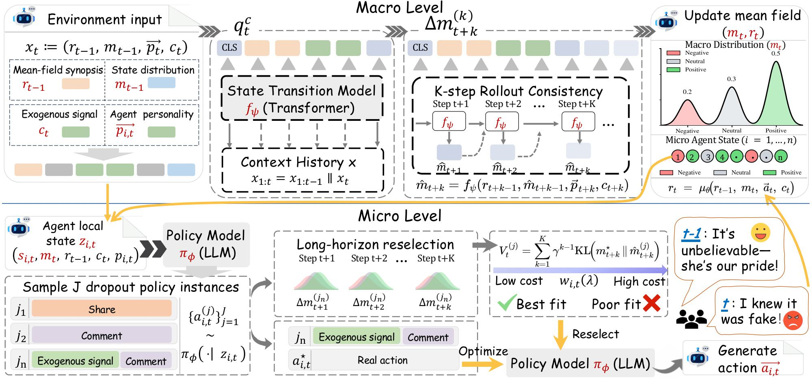

# Coupling Macro Dynamics and Micro States for Long-Horizon Social Simulation

<p align="center">
  <a href="https://arxiv.org/abs/2604.05516">
    
  </a>
  <a href="LICENSE">
    
  </a>
</p>



This repository contains the official implementation for the paper **"Coupling Macro Dynamics and Micro States for Long-Horizon Social Simulation"**. 🧠

> **Abstract**: Social network simulation aims to model collective opinion dynamics in large populations, but existing LLM-based simulators mainly focus on macro-level dynamics while overlooking evolving micro-level internal states. This limits their ability to capture delayed opinion shifts and realistic long-horizon reversals. To address this, we propose **MF-MDP**, a social simulation framework that tightly couples **macro-level collective dynamics** with **micro-level agent states**. MF-MDP explicitly models latent opinion states with a state transition mechanism and formulates the problem as a **Mean-Field Markov Decision Process**, allowing agents to gradually evolve rather than react instantaneously. This design enables more accurate long-horizon simulation, better reversal tracking, and more stable collective dynamics over extended interaction sequences.

---

## ✨ Highlight

Our approach consistently improves long-horizon social simulation and reversal modeling. Compared to prior mean-field simulators, **MF-MDP** achieves:

- 📈 **75.3%** reduction in **long-horizon KL divergence** (**1.2490 → 0.3089**).
- 📈 **66.9%** reduction in **reversal KL divergence** (**1.6425 → 0.5434**).
- 🚀 Stable simulation with up to **40,000 interactions** (vs. **~300** in MF-LLM).

---

## 🗓️ Timeline

- **[2026-04-09]** We have released the **code** covering the entire pipeline.
- **[2026-04-07]** The paper is released on **arXiv**.
---

## 📂 Project Structure


- **`MF_MDP/state_transition/`**: State transition model and related training resources.
- **`MF_MDP/policy/`**: Policy model components.
- **`datasets/`**: Event-level datasets and processed simulation inputs.
- **`main/`**:
  - **`data/`**: Input data directory for simulation.
  - **`mean_field_utils_state/`**: State-aware mean-field utilities.
  - **`script/`**: Main scripts for simulation and preprocessing.
  - **`result/`**: Output directory for generated results and evaluation files.

---

## 🧪 Usage

### 1. Preparation

#### Environment Setup
```bash
poetry install
```

#### Dataset Preparation
Our experiments are conducted on event-centric social media data collected from Weibo.
The raw data can be crawled using MediaCrawler, and then converted into the event format used by this project for simulation and evaluation.
Please place the processed JSON files into:

```text
main/data/
```

The shell script will automatically search for JSON files with more than 1000 comments for batch simulation.


#### Training
For state transition training details, please refer to:

```text
MF_MDP/state_transition/training/README.md
```

### 2. Run

#### Using the Shell Script (Recommended)
The shell script automatically searches for all JSON files with comment count greater than 1000 in `./main/data/` and runs simulations on them.

```bash
# Edit configuration
vim main/script/run_simulation.sh

# Run simulation
bash main/script/run_simulation.sh
```

Key configurations in `run_simulation.sh`:
- `SCRIPT_TYPE="newstate"`: choose the state-aware simulation script.
- `DATA_DIR="./main/data"`: directory containing input event files.
- `simulation_start=50`: comment index where simulation begins.
- `model_type="1.5B"`: base model version, such as 1.5B, 7B, or DeepSeek.
- `batch_size=16`: batch size for simulation.

#### Run Directly with Python
To simulate a single event file:

```bash
python main/script/run_mf_batch_newstate_policy.py \
    --file_name /path/to/json/file \
    --simulation_start 50 \
    --model 1.5B \
    --batch_size 16 \
    --st_model_path /path/to/event_transformer_best.pt
```

### 3. Evaluation
Simulation outputs are saved to:

```text
main/result/{model_path}/evaluation/
```

The saved results include:
- Generated comments
- State distributions
- Mean-field summaries
- Log probabilities

MF-MDP supports both default-step simulation and long-horizon full-trajectory evaluation, making it suitable for studying long-range opinion evolution and reversal dynamics.

---

## 📖 Citation

```bibtex
@misc{zhang2026couplingmacrodynamicsmicro,
      title={Coupling Macro Dynamics and Micro States for Long-Horizon Social Simulation}, 
      author={Yunyao Zhang and Yihao Ai and Zuocheng Ying and Qirui Mi and Junqing Yu and Wei Yang and Zikai Song},
      year={2026},
      eprint={2604.05516},
      archivePrefix={arXiv},
      primaryClass={cs.SI},
      url={https://arxiv.org/abs/2604.05516}, 
}
```

---

## 📜 License
This project is licensed under the MIT License - see the [LICENSE](LICENSE) file for details.
